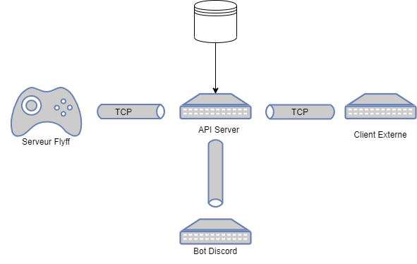

# Flyff-API

Projet `expérimentale` permetant de communiquer avec le serveur FLYFF via des clients extern telque les `bots discord`.  
Le projet est constitué des solutions `TCPNetwork`, `APIConnector`, `APIServer`, `APIClient`.  

## TCPNetwork
Bibliothèque dynamique permettant d'effectuer une connexion et d'envoyer des messages via le protocol `TCP`.  
Language : `C++ 14`.  

## APIConnection
Bibliothèque dynamique, *wrapper* permettant de créer un client/server de l'API.  
Les fonctions primaire sont definie dans cette bibliothèques tel que l'authentification, envoie de commandes...  

## APIServer
Exécutable représsentant le serveur Back-End. 
Il permet relier les serveurs `Flyff`, `Bot Discord` et les `Clients Externes` entre eux, il fait circuler l'informations.  

## APIClient
Exécutable permettant de tester les échanges entre les différentes parties --> ***SANDBOX***.

## Structure du projet

## Packet Structure

Les packets sont structurées de cette manière :
| instruction   | octects   | type          |
| :--------:    | :-----:   | :----:        |
| LENGTH        | 4         | unsigned int  |
| PACKET TYPE   | 4         | unsigned int  |
| DATAS         | X         | X             |

## Server

### Initialisation
La création d'un serveur `API` s'éffectue via la function `createServer`, cette fonction retourne une structure `SFactoryServer`.  
Il faut indiquer à `createServer` le port.
La destruction du serveur `API` s'éffectue via `destroyServer`, cette fonction permet de couper tous les connections TCP ouverte proprement.  
La gestion du pointeur serveur passe via les fonctions `SFactory` fichier TFactory.hpp.  

### Informations
Un serveur peut donc communiquer avec des clients dont le type la liste est define dans `APIMessageHandler.hpp`. 
Lors que le serveur recoit un packet il peut renvoyer l'informations aux autres clients.

## Instruction
1) Creation d'un pointeur `SFactoryServer`.
2) Definir la `callback` pout la reception des paquets. 
3) Authentification

## Client

### Initialisation
La creation d'un client `API` s'éffectue via la function `createClient`, cette fonction retourne une structure `SFactoryClient`.  
Il faut indiquer à `createClient` le port et l'ip du serveur.
La destruction du serveur `API` s'éffectue via `destroyClient`, cette fonction permet de couper tous les connections TCP ouverte proprement.  
La gestion du pointeur `client` passe via les fonctions `SFactory` fichier TFactory.hpp.  

## Information
Un client doit obligatoirement s'authentifier afin de definir sont `type` la liste est présente dans le fichier `APIMessageHandler.hpp`.  

## Instruction
1) Charger la DLL `APIConnector`
2) Creation d'un pointeur `SFactoryClient`.
3) Definie la `callback` pour de la reception des paquets.
3) Authentification

## Bot Discord

## Initialisation
Modifier les fichier `config.json` afin qu'ils correspondent à votre ***identifiants***.

